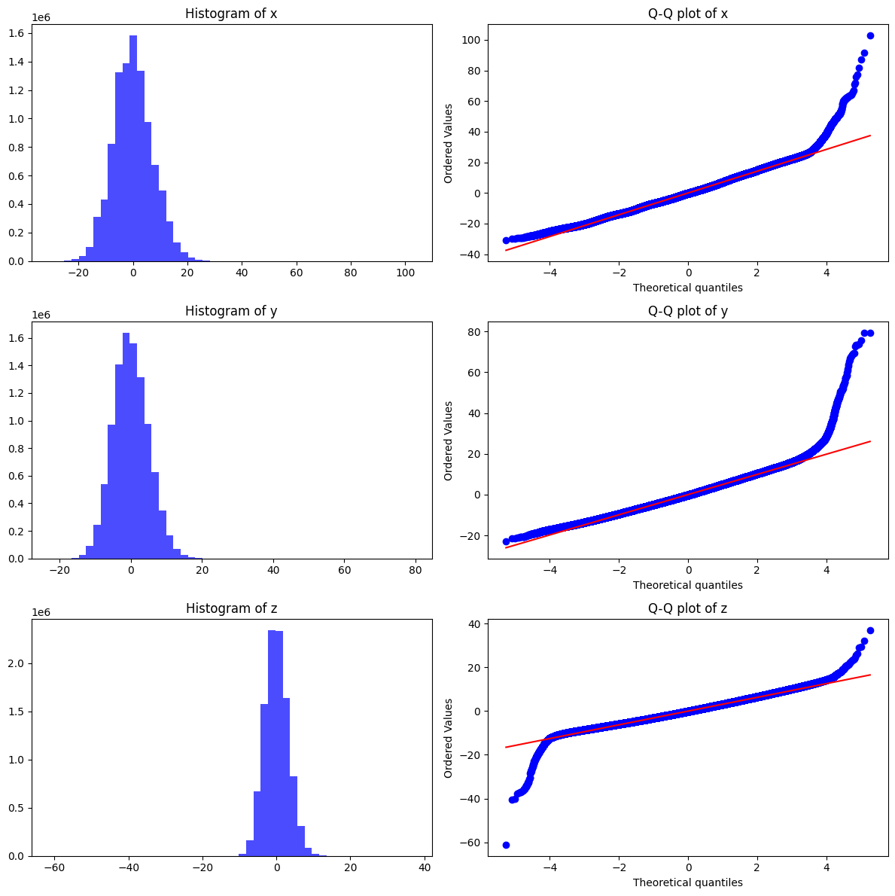
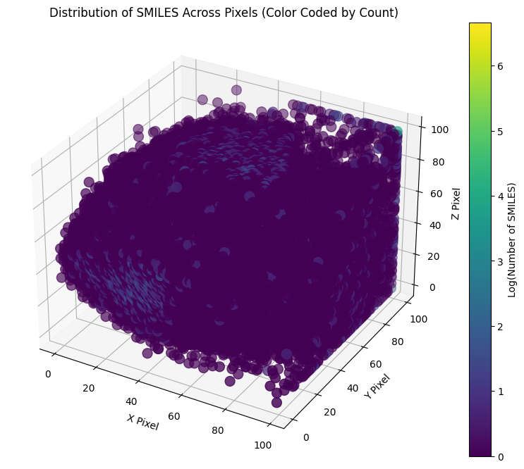
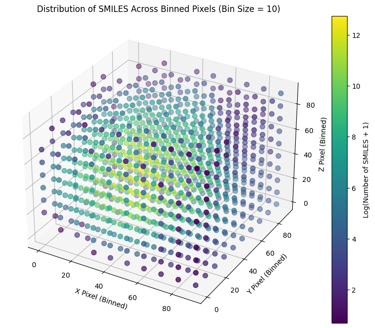

# Chelombus

## Project Overview
Objective: Process a molecular dataset to compute fingerprints, reduce dimensionality using PCA, and output 3D coordinates along with SMILES strings and any available features.

PCA centers the data and projects it onto orthogonal axes (principal components) that capture the most variance. The transformed data along each principal component is often approximately normally distributed (assuming data is reasonably normal)


Requirements:

    Adaptable to datasets with varying features or just SMILES.
    Output should include:
        3D coordinates for each molecule.
        Original SMILES strings.
        Available features from the dataset


### Structure

```bash
molecule-pca-visualization/
├── data/
│   └── sample_dataset.csv         # Place your datasets here
├── src/
│   ├── __init__.py
│   ├── data_handler.py            # Contains DataHandler class
│   ├── fingerprint_calculator.py  # Contains FingerprintCalculator class
│   ├── dimensionality_reducer.py  # Contains DimensionalityReducer class
│   ├── output_generator.py        # Contains OutputGenerator class
│   └── utils/
│       ├── __init__.py
│       └── helper_functions.py    # Any additional helper functions
├── notebooks/
│   └── exploratory_analysis.ipynb # Jupyter notebooks for testing and analysis
├── tests/
│   ├── __init__.py
│   ├── test_data_handler.py       # Unit tests for DataHandler
│   ├── test_fingerprint_calculator.py
│   ├── test_dimensionality_reducer.py
│   └── test_output_generator.py
├── scripts/
│   └── run_pipeline.py            # Script to execute the entire pipeline
├── requirements.txt               # Python dependencies
├── README.md                      # Project description and instructions
├── .gitignore                     # Files and folders to ignore in Git
└── LICENSE                        # License information
```

### Chunk Size test


Test of most optimal chunk size for 10M datapoints. For initial test with 10M datapoints we will set chunk_size = 6050

First test with chunk_size = 650 was 1 hour. 
Now 10M compounds run under 8 minutes


## Fitting to Cube

Need to map the coordiantes into a 100x100x100 cube. 

### Normalizing Approach
Normalizing the coordinates to fit within the [0,1] range and then scaling them to a 100×100×100 cube. 

However I am concern with the impact of outliers. If dataset contains outliers they can disproportionately affect the min-max values. To approach that case we could do: 

$$
x_{scaled} =   \frac{x - \mu_x}{\sigma_x }
$$

And then map the data witihin a certain number of standard deviations (e.g. $-3\sigma$ to $+3\sigma$)

OR

Use the 1th and 99th percentiles as the min-max values for normalization. 

$$
x_{scaled} = \frac{x- P1}{P99 - P1} \times 99
$$


#### Problems 
However for very large datasets ~6 Billion this will probably not work as we cannot fit everything in memory. 

---
### Simple Approach

1. Calculate 0.01 and 99.99 percentiles 
2. Take range on each axis that contains all points between percentiles
2. Create grid by dividing each range on the axis in 100 steps (*pixels*). 
3. Approximate each 3D coordinate from PCA to nearest pixel. 


This is probably the eassiest solution, but again not very efficient for 10B compounds as it will need to calculate the percentiles. 


#### Visualization

*Data for 10M compounds* 

The histograms show that the data along each principal component $(x, y, z)$ is somewhat bell-shaped but with significant skewness and heavy tails, especially in the $x$ and $y$ components.

**The Q-Q plots** (Quantile-Quantile plots) compare the quantiles of our data against the theoretical quantiles of a normal distribution. For perfectly normal data, the points should lie along the red diagonal line. In this case the middle points follow the line, suggesting that the central parts of your distributions are fairly normal.

However, there are deviations at the tails, indicating that the data has heavier tails (i.e., more extreme values) than a normal distribution would predict. This is especially clear for the $x$ and $y$ components, where several points deviate strongly from the line


#### Mapping it to 100x100x100 dimensions
 
**Mapping Points in the correct range to 100 Steps (or Pixels)**

To handle outilers we could see at the percentiles. We can take the $0.01$ Percentile and $99.99$ percentile and use the range between those values as our reference scale. Then divide the distance in as many pixels (steps) as we want to. This way we're only loosing $0.02%$ of the data which for 6 billlion compounds would be around 1.2 million compounds. 

1. **Determine the Step Size**:

For every coordinate we take the percentile_0.01, percentile_99.99 which will be our range that will be divided in 100 steps. 

x = $[-23.65769251 ,30.68569253]$

y = $[-16.20908626, 23.04514974]$

z = $[-10.74670722, 12.98772289]$

and we want to map this range into 100 steps.


### Mapping Strategy

Now we use these percentile-based ranges for each of the coordinates and apply the same logic as before.

#### Step Sizes for Each Coordinate

- For **x**: 
  - Range: $[-23.66, 30.69]$
  - Total Range: $30.69 - (-23.66) = 54.34$
  - Step Size: $ \frac{54.34}{100} = 0.5434$

- For **y**:
  - Range: $[-16.21, 23.05]$
  - Total Range: $23.05 - (-16.21) = 39.26$
  - Step Size: $ \frac{39.26}{100} = 0.3926$

- For **z**:
  - Range: $[-10.75, 12.99]$
  - Total Range: $12.99 - (-10.75) = 23.74$
  - Step Size: $ \frac{23.74}{100} = 0.2374$

### Mapping Formula

For each coordinate, we map the values to a range of 100 steps using the following formula:

$$
\text{Mapped X} = \left\lfloor \frac{x_i - \text{percentile}_\text{0.01}}{\text{step size}_x} \right\rfloor
$$
$$
\text{Mapped Y} = \left\lfloor \frac{y_i - \text{percentile}_\text{0.01}}{\text{step size}_y} \right\rfloor
$$
$$
\text{Mapped Z} = \left\lfloor \frac{z_i - \text{percentile}_\text{0.01}}{\text{step size}_z} \right\rfloor
$$


**Handling Points Outside the Range**:
Since some points in the data may fall outside the range we've to decide how to handle those. We could either: 

  - **Clamp the values**: Any value below $percentile_{0.01}$ is mapped to $percentile_{0.01}$, and any value above $percentile_{99.99}$ is mapped to $percentile_{99.99}$.
  
  - **Ignore the outliers**: Discard any points outside the range, focusing only on the central bulk of the data.

### Output

Top 50 pixels with the most molecules
pixel_43_39_49: 786 SMILES
...
pixel_43_38_55: 566 SMILES

Also around ~70,000 molecules are not grouped together i.e. 1 molecule = 1 pixel 



1M pixels, color coding according to number of compounds clustered in each pixel


Binned pixels. 
Groups the pixel values into larger bins by rounding down to the nearest multiple of the bin_size. In this case is set to 10. This is equivalent to having built a 10x10x10 cube instead of 100x100x100. 


## TO DO
- Add arguments parser to num_dimensions to reduce to 
- Add support for txt and other file typess
- Think of better output type than pd.DataFrame: options Parquet, HDF5, 
- Mkdir output in output_generator.py
- Add directory to save log outputs
- Add argparser to set the dimensions of the cube? e.g. -dim 10 -> 10x10x10 -dim 100 -> 100x100x100

