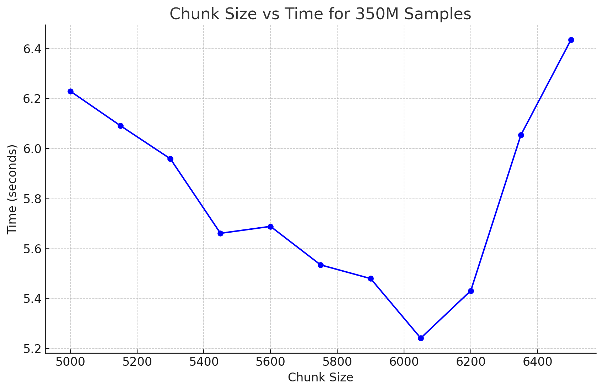

# Chelombus

Chelombus aims to become a tool to explore very large Databases (up to Billions) and create a new approach to visualazing these spaces.


Requirements:

    Adaptable to datasets with varying features or just SMILES. So far suppport for txt, csv and cxsmiles filetypes. 
    Output should include:
        3D coordinates for each molecule.
        Original SMILES strings.
        Available features from the dataset e.g. molecular properties such as heavy atom count or log p


### Structure

```bash
molecule-pca-visualization/
├── data/
│   └── sample_dataset.csv         # Place your datasets here
│   └── output/                    # csv files with header: smiles,x,y,z,*features
├── src/
│   ├── __init__.py
│   ├── data_handler.py            # Contains DataHandler class
│   ├── fingerprint_calculator.py  # Contains FingerprintCalculator class
│   ├── dimensionality_reducer.py  # Contains DimensionalityReducer class
│   ├── output_generator.py        # Contains OutputGenerator class
│   └── utils/
│       ├── __init__.py
│       └── helper_functions.py    # Any additional helper functions
├── notebooks/
│   └── exploratory_analysis.ipynb # Jupyter notebooks for testing and analysis
├── tests/
│   ├── __init__.py
│   ├── test_data_handler.py       # Unit tests for DataHandler
│   ├── test_fingerprint_calculator.py
│   ├── test_dimensionality_reducer.py
│   └── test_output_generator.py
├── scripts/
│   └── run_pipeline.py            # Script to execute the entire pipeline
├── requirements.txt               # Python dependencies
├── README.md                      # Project description and instructions
├── .gitignore                     # Files and folders to ignore in Git
└── LICENSE                        # License information
```

### Chunk Size test



Test of most optimal chunk size for 10M datapoints. For initial test with 10M datapoints we will set chunk_size = 6050

First test with chunk_size = 650 was 1 hour. 
Now 10M compounds can run under 7 minutes (CPU: AMD 7 8700F 8-Core Processor) 


## TO DO
- Add argpaser to num_dimensions to reduce to, -o ouput_name.filetype, 
- Add support for txt and other file typess
- Think of better output type than pd.DataFrame: options Parquet, HDF5, 
- Mkdir output in output_generator.py
- Add directory to save log outputs
