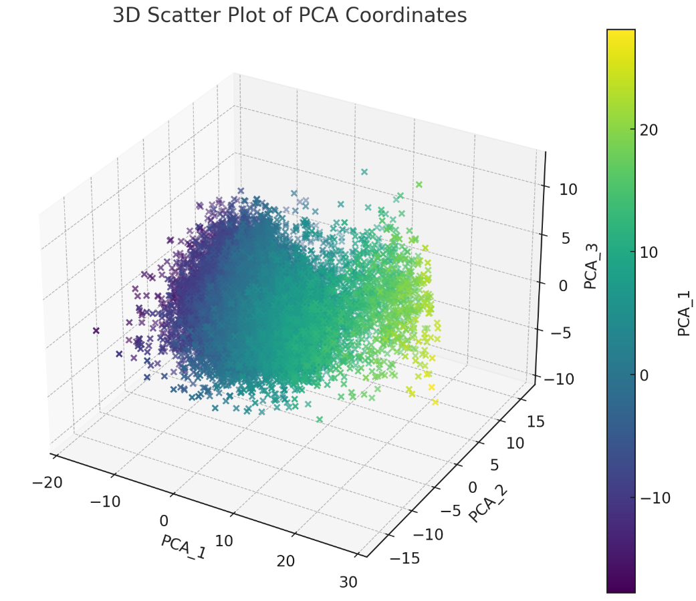
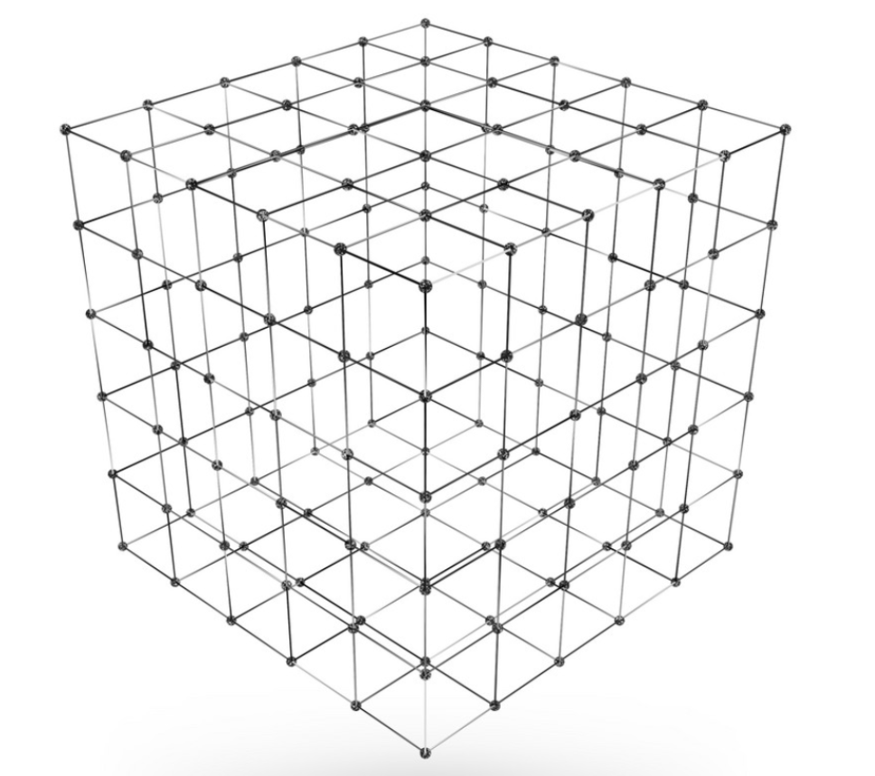
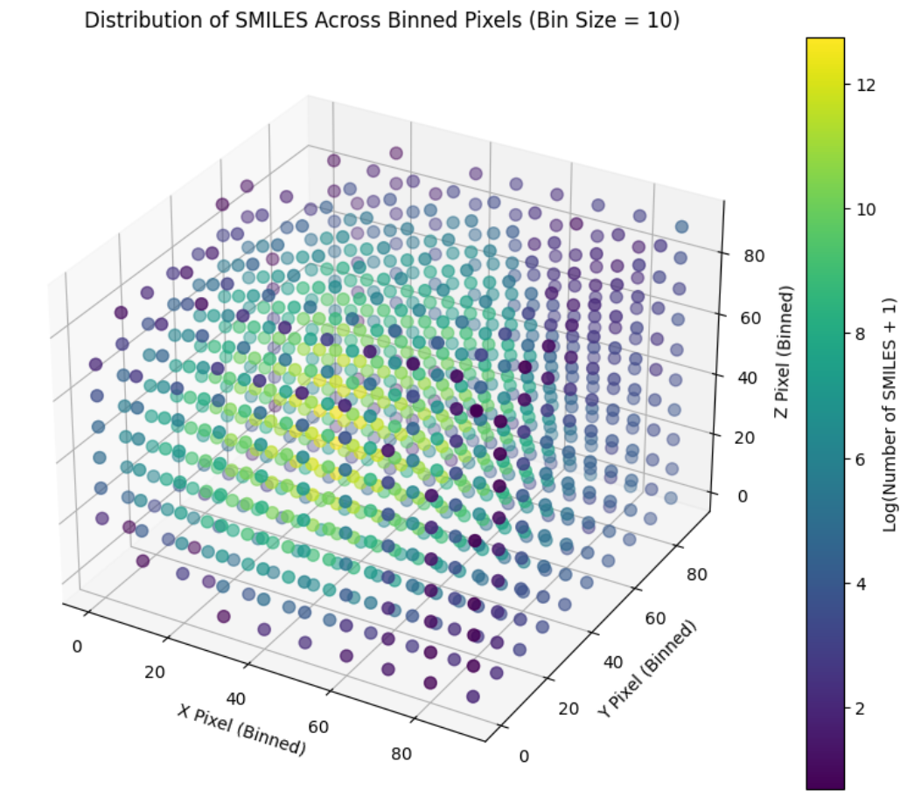
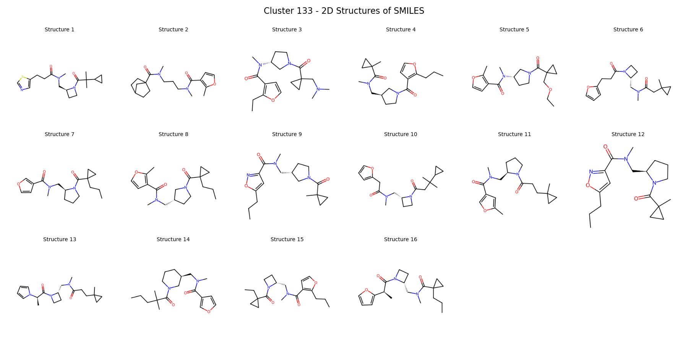
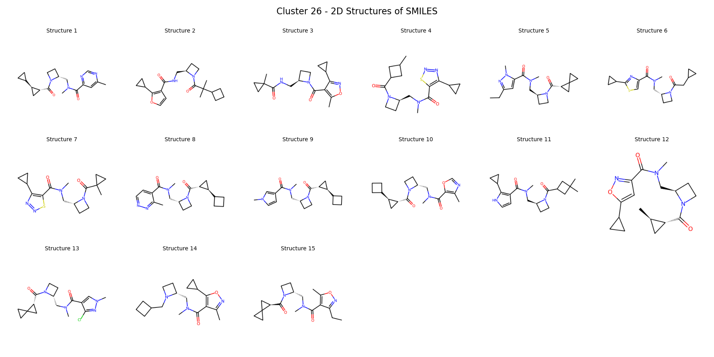

# Chelombus

## Project Overview
Chelombus is a tool designed to visualize exceptionally large datasets of molecules—up to billions of compounds. It combines Principal Component Analysis with dynamic TMAP creation to efficiently cluster and visualize chemical spaces


### Structure

```bash
chelombus/
├── data/
│   └── sample_dataset.csv         # Data
├── src/
│   ├── __init__.py
│   ├── data_handler.py            # Contains DataHandler class
│   ├── fingerprint_calculator.py  # Contains FingerprintCalculator class
│   ├── dimensionality_reducer.py  # Contains DimensionalityReducer class
│   ├── output_generator.py        # Contains OutputGenerator class
│   └── utils/
│       ├── __init__.py
│       └── helper_functions.py    # Any additional helper functions
├── notebooks/
│   └── exploratory_analysis.ipynb # Jupyter notebooks for testing and analysis
├── tests/
│   ├── __init__.py
│   ├── test_data_handler.py       # Unit tests for DataHandler
│   ├── test_fingerprint_calculator.py
│   ├── test_dimensionality_reducer.py
│   └── test_output_generator.py
├── scripts/
│   └── run_pipeline.py            # Script to execute the entire pipeline
├── requirements.txt               # Python dependencies
├── README.md                      # Project description and instructions
├── .gitignore                     # Files and folders to ignore in Git
└── LICENSE                        # License information
```


---- 

## How It Works

### 1. Data Loading and Fingerprint Calculation

Using the `HandleData` module, Chelombus automatically detects the SMILES column in various file formats, including `.csv`, `.txt`, and `.cxsmiles`. It processes the data in chunks to handle large datasets effectively.

For each chunk, it calculates the Molecular Quantum Numbers (MQN) fingerprints, which are 42-dimensional vectors representing the chemical features of the molecules. MQN fingerprints are particularly suitable because they maintain variance well when reduced using PCA.

The data and intermediate computations are saved in `.pkl` files for two main reasons:

1. **Efficiency**: The code needs to iterate over the data multiple times—for fingerprint calculations, PCA transformations, and percentile computations. Storing intermediate steps accelerates the process.
2. **Reusability**: If you need to re-run the code with different parameters, the pre-calculated files allow for quicker execution.

### 2. Incremental PCA (iPCA)

To reduce the dimensionality of the fingerprint vectors, Chelombus employs Incremental PCA (iPCA), a variant of standard PCA that processes data in batches—ideal for large datasets.

- **Dimension Reduction**: While reducing dimensions, it's observed that variance drops below 95% when going below 3D. Therefore, it's recommended to keep at least 3 principal components.
- **Configuration**: You can set the number of components with the `PCA_N_COMPONENTS` parameter in the `config.py` file.
- **Process**:
    - Performs a partial fit of the full MQN vectors for each batch.
    - Transforms the data, reducing the 42-dimensional fingerprints to the selected lower-dimensional space.

### 3. Creating the N-Dimensional Grid (e.g., 3D Cube)

After reducing the fingerprints to, say, 3-dimensional vectors, we can represent these points in a 3D space. However, plotting all points directly isn't very informative due to data density and overlap.

Actually, if you do this you'll get something like this:



Which is not very useful. 

To address this, we:

- **Divide Each PCA Dimension into Fixed Steps**: For example, we can divide each dimension into steps of 0.5 or integers (e.g., 0, 1, 2, ..., 100), creating a grid.
- **Create a Grid or "Pixels"**: Each intersection point in the grid represents a "pixel" or bin in the N-dimensional space


 
- **Assign Compounds to Pixels**: Each compound is mapped to the nearest **pixel** based on its PCA-reduced coordinates. Multiple compounds may fall into the same pixel, thus clustering the result. 
### The fitting
Now, what if we fit every compound with its respective 3D coordinates to these points in the cube? Every point will fall in the pixel that its closest to. Some of the points will be grouped in the same pixel and some pixels will have only one compound, or none. 

**Visual** **Example**
**High Pixel Density (100×100×100 Grid)**: Mapping ~200,000 compounds results in a cluttered visualization.


It's a little bit messy, so let's change the step size (pixel density) of the cube to 10x10x10. 



**Reduced Pixel Density (10×10×10 Grid)**: By increasing the step size, we get fewer pixels and more compounds per pixel, resulting in a clearer visualization.

The range in which the points are dispersed is the same $[0, 100]$, we just changed the step size from 1 to 100, which means now the pixels can only take coordinates $[0, 10, 20 ..., 90, 100]$. 

### 4. Selecting the Range for Each PCA Axis

An important consideration in PCA analysis is how to select an appropriate range for each axis. Two key approaches are outlined below:

#### Normalization (Recommended)

A straightforward method for defining the range is normalizing the coordinates to fit within the $[0,1]$ interval and then scaling them into a 100×100×100 cube by multiplying each coordinate by 100. 

However, this approach has limitations when the dataset contains outliers. Outliers can disproportionately affect the min-max values, leading to skewed results. To address this, one could use standard scaling:

$$
x_{scaled} = \frac{x - \mu_x}{\sigma_x}
$$

Then, map the scaled data within a specific number of standard deviations, for example, $-3\sigma$ to $+3\sigma$.

While effective in many cases, this approach assumes normal distribution, which may not hold true for real-world data. In our dataset, histograms of each principal component $(x, y, z)$ suggest bell-shaped distributions, but with noticeable skewness and heavy tails, particularly in the $x$ and $y$ components.

**Q-Q plots** (Quantile-Quantile plots) further illustrate this. These plots compare data quantiles to theoretical quantiles of a normal distribution. While the central parts of the distributions align with the expected normal pattern, the tails deviate significantly, indicating heavier tails (i.e., more extreme values) than a normal distribution would predict. This is especially prominent in the $x$ and $y$ components, where several data points deviate substantially.

Additionally, this method requires recalculating means and deviations for every batch of data, which is computationally inefficient for large datasets.

#### Percentiles and T-digest (Recommended)

A simpler and more robust alternative is using percentiles to define a range that covers most of the data. By examining the histograms, we can see that for the $x$ axis, the majority of data falls within the $[-20, 20]$ range. More precisely, if we look at the 0.01 percentile and 99.9 percentile, we get a range of $[-23.691, 29.468]$. This range captures almost all of the data while effectively handling outliers. Any point outside this range is assigned the minimum or maximum value of the range, ensuring only about 0.02% of the data (the outliers) are clustered at these boundary values.

For efficient percentile calculation across billions of compounds, we use **T-Digest**, a data structure developed by Ted Dunning. T-Digest allows efficient percentile estimation in streaming or distributed data, enabling us to update percentiles dynamically as batches of data are processed.

While incorporating T-Digest increases computation time (e.g., adding 10 minutes to a typical 5-minute pipeline for 10 million compounds), we mitigate this by applying T-Digest to only ~5% of the data. This trade-off between speed and accuracy is worthwhile, as it clusters outlier data without sacrificing overall precision.

By selecting ranges based on percentiles and utilizing T-Digest, we maintain efficient processing without significantly impacting data integrity.

### The clustering

Now that we've successfully mapped the data points based on the selected percentiles, step size, and number of PCA dimensions, we can evaluate the effectiveness of the clustering. The question arises: _Does the clustering make sense, and is it effective?_

The answer is: **Yes!**

By examining the molecular structures within some of the mapped clusters, we observe that molecules with very similar chemical structures are consistently grouped together. Below are a few visual examples:

These visuals demonstrate that our approach has effectively created meaningful clusters, even in high-dimensional space.



## class FingerprintCalculator

### Initiate 
fp_calculator = FingerprintCalculator(your_dataframe['smiles'], 'mqn') --> This will calculate the MQN fingerprints. 
For example, this way is used when running the clustering pipeline as it will only work with MQN fingerprints

fp_calculator = FingerprintCalculator(smiles_list, 'mhfp', permutations=1024) --> This will calculate the MHFP with 1024 permutations (default is 512)

### Calculate fingerprints
fingerpints = fp_calculator.calculate_fingerprints() -> returns np.array witht the fp vectors of same length as smiles_list
